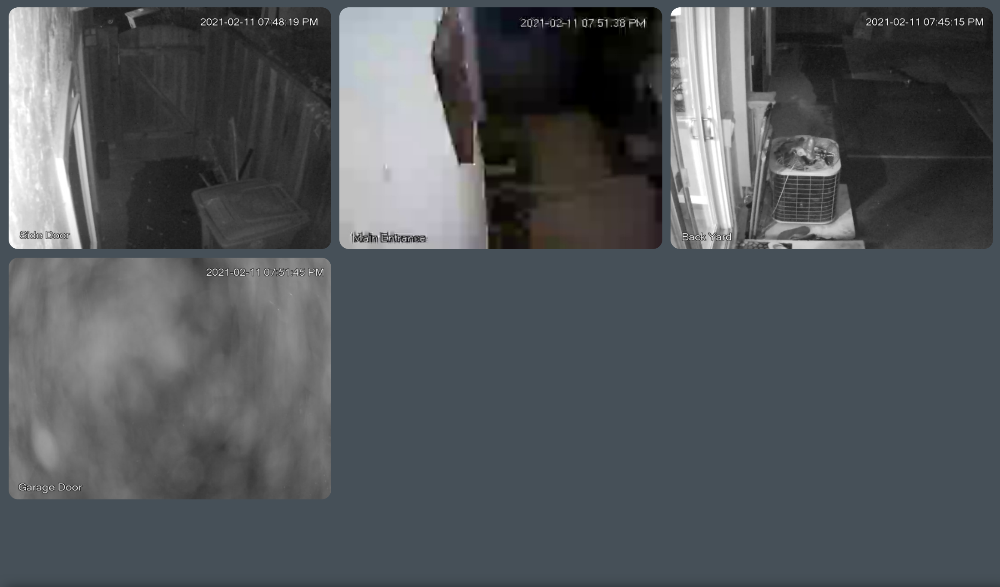
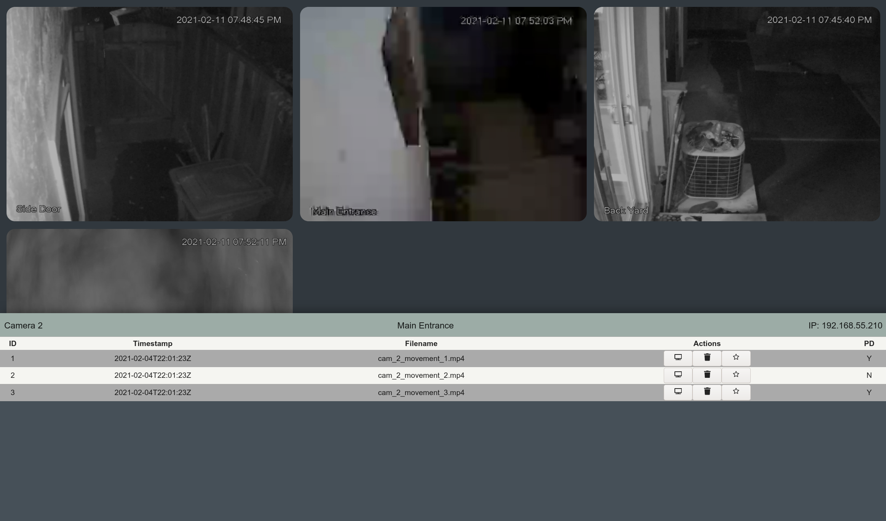

# Homolo App

Self-hostable free web application to view security cameras connected to the same network. View logs of movement on all cameras and get notified when your cameras detect movement.

I am currently looking at running all movement images/videos through a image classifier to detect people in movement.

* Backend: Django 3.2
* Database: MySQL 8.0
* Containerization: Docker
* Front-end: React + custom CSS

Images:

Development still in progress.
